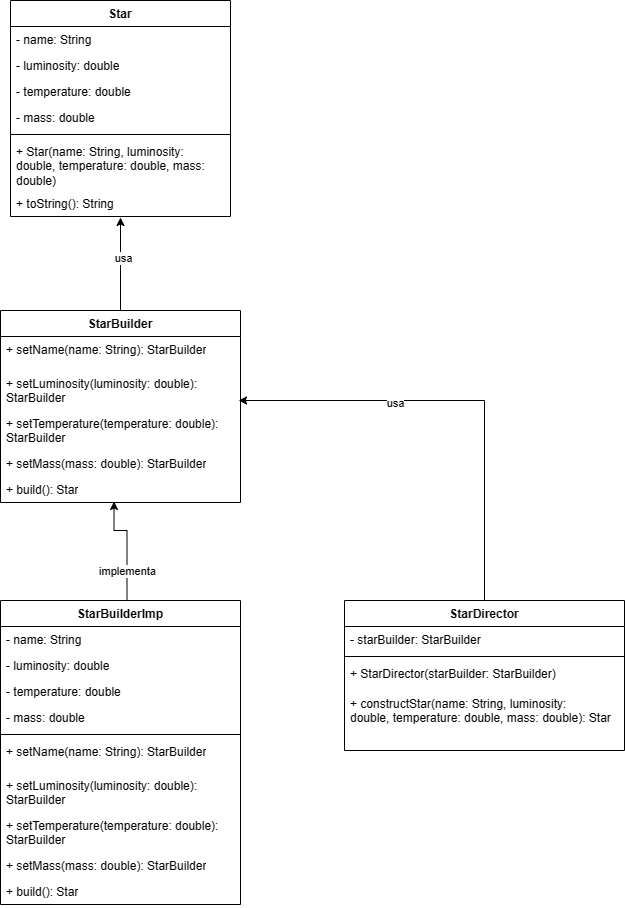

# 💻 Padrões de Projeto
Este repositório contém um trabalho da disciplina de Engenharia de Software (BCC3004 - UTFPR Campus Campo Mourão), que consiste em uma prática envolvendo padrões de projeto.

Padrões de projeto descrevem objetos e classes que se relacionam para resolver um problema de projeto genérico em um contexto particular. Cada padrão descreve um problema que sempre ocorre em nosso contexto e uma solução para ele, de forma que possamos usá-la um milhão de vezes.

Nesse sentido, os padrões de projeto podem ser classificados como:

- **Criacionais**: padrões que propõem soluções flexíveis para criação de objetos.
- **Estruturais**: padrões que propõem soluções flexíveis para composição de classes e objetos.
- **Comportamentais**: padrões que propõem soluções flexíveis para interação e divisão de responsabilidades entre classes e objetos.

Para este trabalho, foram escolhidos 3 padrões de cada categoria, a saber: *Builder (padrão criacional)*; *Decorator (estrutural)* e *Observer (comportamental)*. Além disso, para cada um, foram desenvolvidos exemplos de código na linguagem de programação Java. Vejamos os padrões escolhidos.

## 📝 Builder (criacional)
### Propósito
O padrão de projeto *Builder* é uma técnica que permite a construção de objetos complexos passo a passo. Uma analogia pode ser feita: assim como a construção de uma casa, onde cada etapa é executada gradualmente - desde o projeto arquitetural, passando pela preparação do terreno, estrutura, até as paredes, telhado e acabamentos - o *Builder* nos permite construir objetos de forma incremental, controlando cada aspecto do processo.

### Problema
Imagine um objeto complexo que necessite de uma inicialização passo a passo de muitos campos e objetos. É preciso de um construtor monstruoso com vários parâmetros, aumentando o acoplamento do código (métrica CBO).

### Solução
O padrão *Builder* sugere a exttração do código de construção do objeto para fora de sua própria classe e mova ele para objetos separados chamados *builders*. Estruturalmente, temos o *diretor*, que define a ordem na qual executar as etapas de construção, e o *builder*, que provê a implementação dessas etapas.

### Exemplo
Para o exemplo, considere o contexto da construção de um objeto `Star`, com atributos como nome, luminosidade, temperatura e massa. Com o padrão de projeto *Builder*, podemos separar a construção de uma estrela em passos individuais e fornecer métodos para configurar cada atributo separadamente. Nesse sentido, temos as classes:

- **`Star`**: Representa a estrela que queremos construir, com atributos como nome, luminosidade, temperatura e massa.

- **`StarBuilder`**: Define a interface para a construção de uma estrela. Contém métodos para definir os atributos.

- **`StarBuilderImpl`**: Implementa a interface `StarBuilder`. Responsável por construir a estrela, fornecendo métodos para configurar os atributos da estrela.

- **`StarDirector`**: Coordena o processo de construção da estrela. Recebe um `StarBuilder` e utiliza-o para construir uma estrela conforme uma sequência de passos.

- **`Main`**: Contém o código de exemplo para demonstrar como usar o padrão de projeto Builder para construir uma estrela.

O código de exemplo encontra-se [aqui](https://github.com/anacarlaquallio/padroes-projeto/tree/main/builder) e a figura abaixo mostra o diagrama UML das classes descritas anteriormente.

## 📝 Decorator (estrutural)

### Propósito
O padrão de projeto *Decorator* permite adicionar comportamentos adicionais a objetos dinamicamente. Ele é útil quando é preciso estender o comportamento de um objeto sem alterar sua estrutura básica.

### Problema
Suponha que estamos lidando com objetos complexos que precisam de funcionalidades adicionais. A adição dessas funcionalidades através da herança de classes pode se tornar impraticável e a criação de subclasses para cada combinação de funcionalidades resultaria em uma hierarquia de classes inflexível. 

### Solução
O padrão *Decorator* sugere encapsular o objeto original em uma série de objetos decoradores, cada um adicionando responsabilidades adicionais sem afetar a estrutura do objeto original. Estruturalmente, o padrão *Decorator* consiste em um componente base que define a interface para os objetos que podem ser decorados, decoradores concretos que adicionam funcionalidades adicionais e um cliente que utiliza os objetos decorados.

### Exemplo
Para o exemplo, considere o contexto da série Cosmos, de Carl Sagan, disponível no [YouTube](https://youtube.com/playlist?list=PLWTsw1mh-VO-MONi88PiY6KstvIxw0Hcj&si=UXhOzgKUKpN_tTyq). Para criar uma aplicação que permite visualizar informações sobre os episódios da série, vamos criar um *decorator* para adicionar funcionalidades de legendas em diferentes idiomas aos episódios, com as classes:

- **`Episode`**: Interface que define o componente base que representa um episódio da série "Cosmos";

- **`CosmosEpisode`**: Implementação concreta da interface `Episode`. Representa um episódio específico da série "Cosmos";

- **`SubtitleDecorator`**: Classe abstrata que serve como base para todos os decoradores de legendas;

- **`PortugueseSubtitle`**: Implementação concreta do decorador para legendas em português;

- **`SpanishSubtitle`**: Implementação concreta do decorador de legendas para legendas em espanhol;

- **`Main`**: Cria instâncias de episódios e aplica os decoradores para adicionar legendas em português e espanhol.

## 📝 Observer (comportamental)

### 📚 Bibliografia

Marco Tulio Valente. Engenharia de Software Moderna: Princípios e Práticas para Desenvolvimento de Software com Produtividade, Editora: Independente, 2020.

Refactoring Guru. Padrões de Projeto. Disponível em: https://refactoring.guru/pt-br/design-patterns. Acesso em: 12 maio 2024.